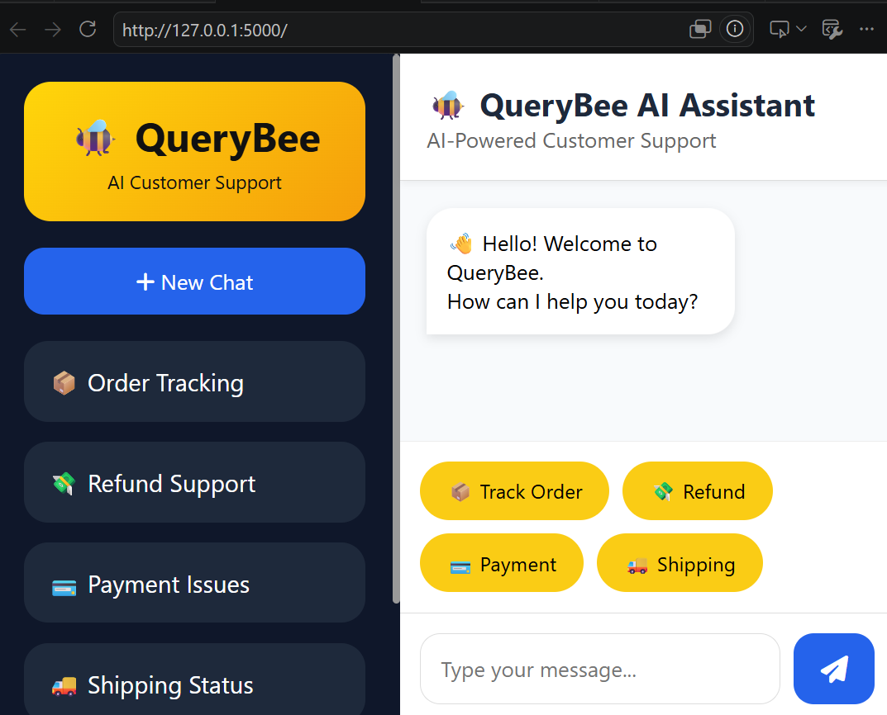
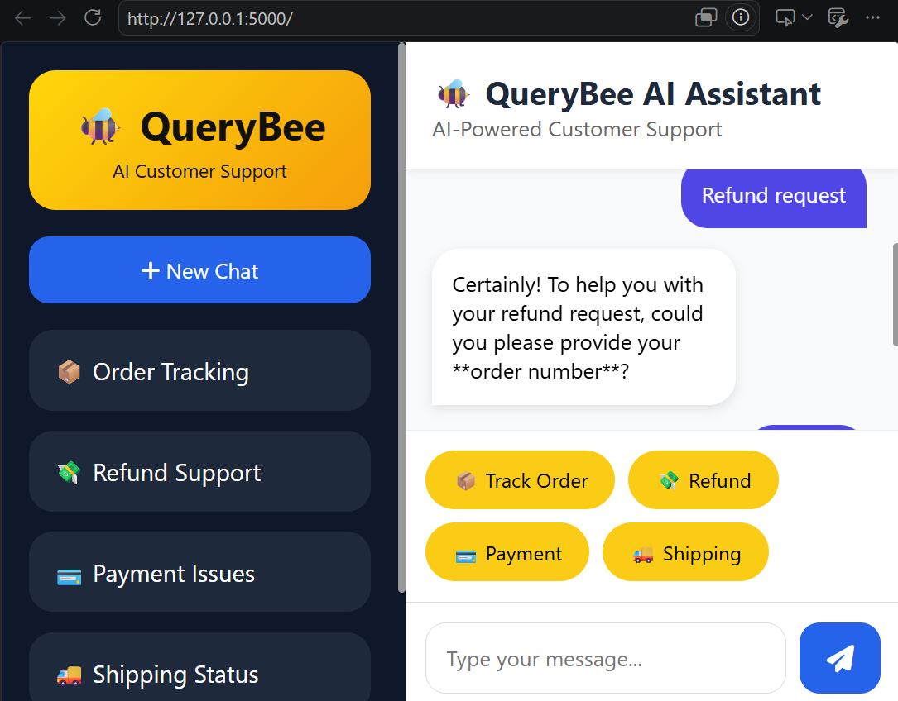

🐝 QueryBee – AI Customer Support Chatbot

## Overview

QueryBee is an AI-powered customer support chatbot developed using Python, Flask, RapidFuzz, and Google Gemini AI. The application helps customers resolve common support queries such as order tracking, shipping status, refund requests, payment issues, and product-related questions through an intuitive conversational interface.

The chatbot combines intent-based query matching with generative AI capabilities to provide accurate and natural responses.

---

## Features

* Order tracking using Order ID
* Shipping and delivery status support
* Refund and cancellation assistance
* Payment issue handling
* Product information support
* Customer support guidance
* AI-powered responses using Google Gemini
* Fuzzy query matching for better user experience
* Responsive and modern user interface

---

## Technologies Used

### Backend

* Python
* Flask

### Frontend

* HTML
* CSS
* JavaScript

### AI & NLP

* Google Gemini API
* RapidFuzz

### Version Control

* Git
* GitHub

---

## Project Structure

```text
QueryBee/
│
├── app.py
├── chatbot.py
├── intents.json
├── README.md
├── .gitignore
│
├── screenshots/
│   ├── Home.png
│   └── Chat.png
│
├── templates/
│   └── index.html
│
├── static/
│   ├── style.css
│   └── script.js
```

---

## Installation

### Clone the Repository

```bash
git clone https://github.com/Yuvasri-R2308/QueryBee.git
cd QueryBee
```

### Create a Virtual Environment

```bash
python -m venv venv
```

### Activate Virtual Environment

Windows:

```bash
venv\Scripts\activate
```

### Install Required Packages

```bash
pip install flask rapidfuzz google-generativeai
```

### Configure API Key

Create a file named `config.py`

```python
GEMINI_API_KEY = "YOUR_GEMINI_API_KEY"
```

### Run the Application

```bash
python app.py
```

Open the application in your browser:

```text
http://127.0.0.1:5000
```

---

## Screenshots

### Home Interface



### Chat Interface



---

## Sample Queries

```text
Where is my order?
Track order ORD001
Shipping status
Refund my order
Payment issue
Product information
Contact support
```

---

## Future Enhancements

* Database integration for real-time order management
* User authentication and profile management
* Voice-enabled chatbot support
* Multi-language support
* Customer ticket management system
* Analytics dashboard for customer support monitoring

---

## Learning Outcomes

This project helped in gaining practical experience with:

* Flask web application development
* API integration
* Natural language query processing
* Customer support automation
* Frontend and backend integration
* Git and GitHub workflow

---

## Author

**Yuvasri R**

B.Tech Information Technology
St. Joseph's College of Engineering

GitHub: https://github.com/Yuvasri-R2308

---

## License

This project is developed for educational and portfolio purposes.
